# Azure Web Server Infrastructure - Production Architecture

## Architecture Overview

This diagram represents the production-grade Azure infrastructure for a web server deployment using Terraform.

## Security Architecture

```mermaid
graph TB
    %% Security Layers
    subgraph SecurityLayers["🔒 Multi-Layer Security Architecture"]

        %% Network Security
        subgraph NetworkSec["🌐 Network Security"]
            NSG1[🛡️ Network Security Group<br/>- HTTP: Allow 0.0.0.0/0:80<br/>- SSH: Allow 0.0.0.0/0:22<br/>- Default: Deny All]
            Subnet1[🏠 Subnet Isolation<br/>- Private IP Space<br/>- 10.0.1.0/24]
        end

        %% Identity Security
        subgraph IdentitySec["🆔 Identity & Access"]
            UAI1[👤 User Assigned Identity<br/>- No Password/Key Storage<br/>- Azure AD Integration]
            RBAC1[🔑 Role-Based Access<br/>- Storage Blob Data Contributor<br/>- Least Privilege Principle]
        end

        %% Compute Security
        subgraph ComputeSec["💻 Compute Security"]
            SSHKey[🔐 SSH Key Authentication<br/>- Password Auth Disabled<br/>- Public Key Only]
            Disk1[💾 Premium SSD<br/>- Encryption at Rest<br/>- ReadWrite Caching]
        end

        %% Storage Security
        subgraph StorageSec["🗂️ Storage Security"]
            TLS1[🔒 TLS 1.2 Minimum<br/>- Transport Encryption]
            Retention1[📅 7-Day Retention Policy<br/>- Automatic Cleanup]
            Private1[🔒 Private Container Access<br/>- No Public Access]
        end

    end

    %% Security Flow
    Internet2([🌍 Internet])
    Internet2 -->|Filtered by| NSG1
    NSG1 -->|Routes to| Subnet1
    Subnet1 -->|Hosts| SSHKey
    SSHKey -->|Authenticates| UAI1
    UAI1 -->|Authorized by| RBAC1
    RBAC1 -->|Accesses| TLS1
    TLS1 --> Private1
    Private1 --> Retention1

    classDef security fill:#e81123,stroke:#b8000c,stroke-width:2px,color:#fff
    classDef network fill:#7fba00,stroke:#5c8500,stroke-width:2px,color:#fff
    classDef identity fill:#0078d4,stroke:#005a9e,stroke-width:2px,color:#fff
    classDef storage fill:#ff8c00,stroke:#cc6600,stroke-width:2px,color:#fff

    class NetworkSec,NSG1 network
    class IdentitySec,UAI1,RBAC1 identity
    class ComputeSec,SSHKey,Disk1 security
    class StorageSec,TLS1,Retention1,Private1 storage
```

## Data Flow Architecture

```mermaid
sequenceDiagram
    participant U as 👤 User
    participant I as 🌐 Internet
    participant PIP as 📍 Public IP
    participant NSG as 🛡️ NSG
    participant VM as 🖥️ Virtual Machine
    participant A as 🌐 Apache
    participant CLI as ⚙️ Azure CLI
    participant UAI as 🆔 Managed Identity
    participant SA as 🗂️ Storage Account

    Note over U,SA: Web Request Flow
    U->>I: HTTP Request
    I->>PIP: Route to Public IP
    PIP->>NSG: Security Check
    NSG->>VM: Allow HTTP (Port 80)
    VM->>A: Forward to Apache
    A->>VM: Generate Response + Log
    VM->>NSG: Return Response
    NSG->>PIP: Forward Response
    PIP->>I: Route Response
    I->>U: HTTP Response

    Note over VM,SA: Log Upload Flow (Daily)
    VM->>CLI: Trigger Log Upload
    CLI->>UAI: Request Identity Token
    UAI->>CLI: Return Token
    CLI->>SA: Upload Logs (Authenticated)
    SA->>SA: Store in Container

    Note over VM,SA: Authentication Flow
    VM->>UAI: Request Storage Access
    UAI->>SA: Validate Permissions
    SA->>UAI: Grant Access
    UAI->>VM: Provide Token
```

## Infrastructure Components

### Core Infrastructure

- **Resource Group**: Logical container for all resources
- **Virtual Network**: Isolated network environment (10.0.0.0/16)
- **Public Subnet**: DMZ for web-facing resources (10.0.1.0/24)
- **Network Security Group**: Firewall rules for HTTP and SSH
- **Public IP**: Static IP for internet access

### Compute Layer

- **Linux Virtual Machine**: Ubuntu 22.04 LTS on Standard_B1s
- **Premium SSD**: High-performance storage with encryption
- **Network Interface**: Dynamic private IP assignment
- **User Assigned Identity**: Secure access to Azure services

### Storage Layer

- **Storage Account**: Centralized log storage with LRS replication
- **Blob Container**: Private container for application logs
- **7-day Retention**: Automatic cleanup policy

### Security Features

- **SSH Key Authentication**: No password authentication
- **TLS 1.2 Minimum**: Secure transport encryption
- **Role-Based Access**: Least privilege access model
- **Network Segmentation**: Isolated subnets and security groups

### Automation & Management

- **Terraform**: Infrastructure as Code deployment
- **Cloud-Init**: Automated VM configuration
- **Managed Identity**: Passwordless authentication
- **Automated Log Upload**: Daily log rotation and upload

## Production Readiness Features

1. **High Availability**: Can be extended with availability sets/zones
2. **Security**: Multi-layer security with managed identities
3. **Monitoring**: Log aggregation in Azure Storage
4. **Scalability**: Template supports multiple environments
5. **Cost Optimization**: B-series VMs for variable workloads
6. **Compliance**: Encryption at rest and in transit
7. **Automation**: Fully automated deployment and configuration
8. **Maintenance**: Automated log management and cleanup

## Environment Variables

- `{env}`: Environment name (dev/staging/prod)
- `{random}`: Random suffix for global uniqueness

This architecture provides a solid foundation for a production web server with proper security, monitoring, and automation capabilities.
